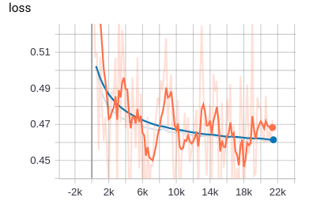
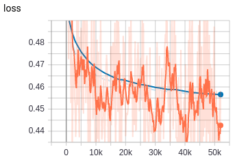
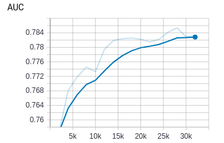
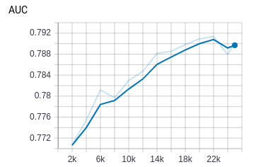
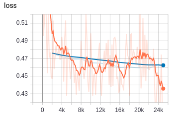
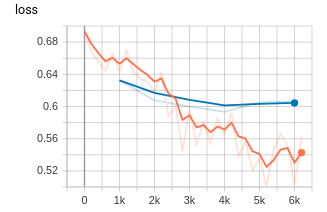
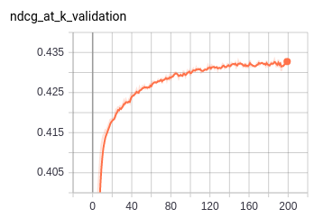
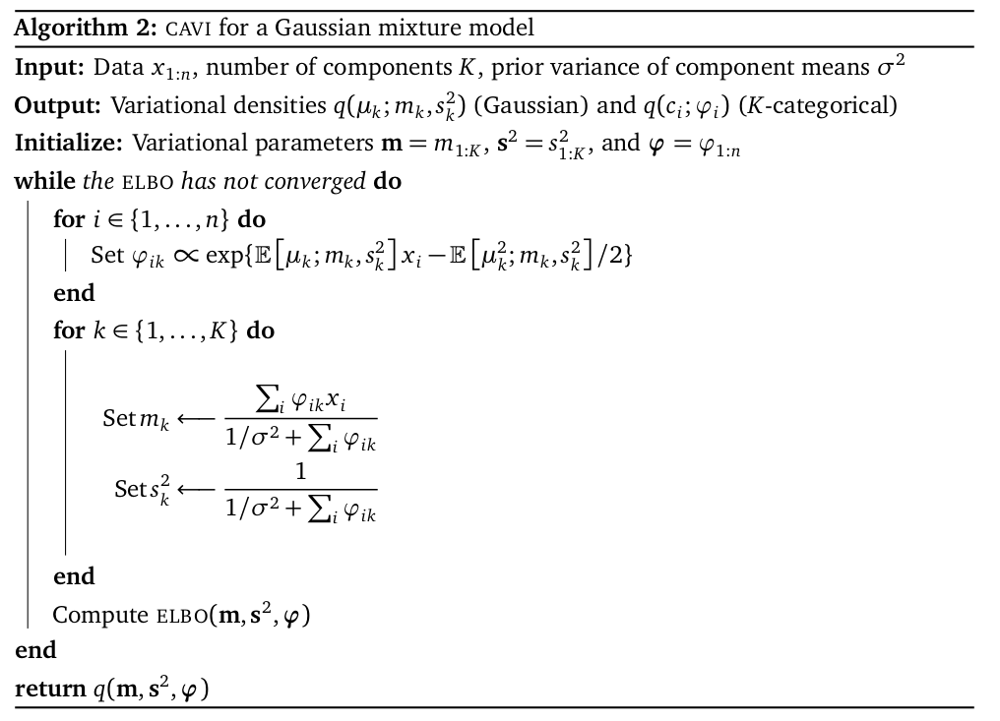
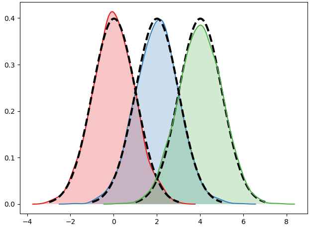
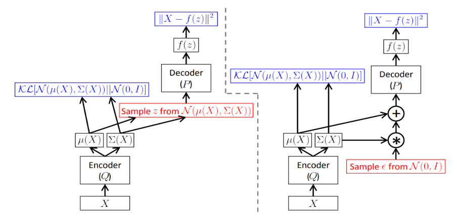

# Recsys algorithms, [相关paper目录](https://github.com/wangruichens/papers-machinelearning/tree/master/recsys)。

> - [Performance Summary (Traditional Feature Interaction)](#performance-summary-traditional-feature-interaction)
> - [Performance Summary (Attention based algorithms)](#performance-summary-attention-based-algorithms)
> - [Performance Summary (Collaborative Filtering Based Algorithms)](#performance-summary-cf-based-algorithms)

## 算法：
- LR (FTRL)
- DNN
- FM
- GBDT + LR
- CADE (Collaborative Denoising Auto-Encoder)
- DeepFM (tf serving 保存模型 / grpc/rest client 调用demo)
- xDeepFM
- DCN (Deep Cross Network)
- Deep & Wide
- DIN (Deep Interest Network)
- VAE-CF (Variational Autoencoders for Collaborative Filtering)

# Performance Summary (Traditional Feature Interaction)

Algorithm     |Paper AUC| Experiment AUC | Paper Loss | Experiment Loss
--------------|-------: |---------------:|-----------:|----------------:
DeepFM        | 0.8007  | 0.7888         |  0.4508    | 0.4608
xDeepFM       | 0.8012  |  0.79793376    |  0.4493    | 0.45614
DCN           | 0.7961  | 0.78843915     |  0.4508    | 0.46  
DNN           | 0.7991  | 0.7773         |  0.4408    | 0.6369 
FM            | 0.7900  | 0.7901         |  0.4592    | 0.4591 

###### Notes

- 都采用criteo dataset, 共39个fields, [参考 data statistics](https://www.kaggle.com/c/criteo-display-ad-challenge/discussion/9651#latest-51948)。采用相同的数据预处理。embedding size 都选取16维。数据处理加转tfrecords都存在[这里](xdeepfm)

- 主要比较不同算法的区别性。对于共有的dnn part，这里我都采用了100,100的二层结构。

- 都采用256 step size。训练总step 1w~5w不等，不同算法需要的迭代次数不同。有些算法容易过拟合，有些可以多跑几轮，取决于模型表达能力。

- 虽然没有经过预处理和调参，与paper中的结果去比较没有什么意义，纯属顺手列在这里，作为参考。


## Deepfm
```angular2
论文结果：  AUC = 0.8007 logloss=0.4508
实验结果：  AUC = 0.7888 logloss=0.4608
平均速度：global_step/sec: 12
```


## xDeepfm
```angular2
论文结果：AUC = 0.8012 logloss = 0.4493
实验结果：AUC = 0.79793376 logloss = 0.45614
平均速度：global_step/sec: 14
```


## DCN (Deep and Cross Network)
```angular2
论文结果：AUC = 0.7961 logloss=0.4508
实验结果：AUC = 0.78843915 logloss =0.46
平均速度：global_step/sec: 45
```

dcn 确实跑的挺快，主要优势在于xT * w 以后得到的是一维标量。计算量会比其他的网络明显小很多。训练速度几乎是deepfm,xdeepfm的3倍~4倍速度。[更多细节看这里](dcn/)



## DNN
```angular2
论文结果： AUC = 0.7991 logloss=0.4408
实验结果： AUC = 0.7773 logloss=0.6369
平均速度：global_step/sec: 41
```
论文里的那些dnn似乎效果都不错。我这里的raw feature embedding 加上两层100,100的dnn差距很明显。在8k~1w步的时候就开始过拟合了。没有调参，区别还是很大的。

另一方面也体现出那些复杂模型的优势，不太需要特征处理，模型即使0调参，效果也不会如此之大。


## FM
```angular2
论文结果： AUC = 0.7900 logloss=0.4592
实验结果： AUC = 0.7901 logloss=0.4591
平均速度：global_step/sec: 23
```



# Performance Summary (Attention based algorithms)


Algorithm     |Paper AUC| Experiment AUC | Paper Loss | Experiment Loss
--------------|-------: |---------------:|-----------:|----------------:
DIN        | 0.8818  | 0.7447         |  None    | None

###### Notes

- 采用Amazon Electro dataset, 负样本随机生成。

## DIN
```angular2
论文结果：  AUC = 0.8818 
实验结果：  AUC = 0.7447 
平均速度：global_step/sec: 124
```
论文中的AUC很高，与正负样本构造的选择很有关系。如果直接全局负采样，模型很容易跑出auc 0.9以上。 因为热门item一般只占全局中很少的一部分。一个解决方法是先把item按频率分桶，然后在生成对应正样本的负样本时，在相同频率的桶中抽取负样本。 




# Performance Summary (Collaborative Filtering Based Algorithms)


Algorithm     |Paper Recall@20| Experiment Recall@20 | Paper NDCG@100 | Experiment NDCG@100
--------------|-------: |---------------:|-----------:|----------------:
 Multi-VAE^{PR}       | 0.395  | 0.3943        |  0.42478    | 0.426 |
Multi-DAE       | 0.387  | 0.38739         |  0.419    | 0.41993 | 


###### Notes

- 采用[MovieLens 20M dataset](http://files.grouplens.org/datasets/movielens/ml-20m.zip)

## VAE-CF

Multi-VAE^{PR} 修改了目标函数，加入了一个beta约束。当beta小于1时，先验的约束减小，拟合的权重变大。采用模拟退火算法来比较高效的得到beta的合适值。

[original code ref](https://github.com/dawenl/vae_cf/blob/master/VAE_ML20M_WWW2018.ipynb)



#### 知识储备：

##### Variational Inference 变分推断

原paper:[Variational Inference: A Review for Statisticians](https://github.com/wangruichens/papers-machinelearning/blob/master/basis/Variational%20Inference:%20A%20Review%20for%20Statisticians.pdf)

笔记：[Variational Inference](https://github.com/wangruichens/notes/blob/master/variational%20inference/Starting%20from%20Information.pdf), 


Variational Inference case study : GMM [ref](https://blog.csdn.net/qy20115549/article/details/86694325)



code : [vi_gmm.py](vae-cf/vi_gmm.py)



##### Variational AutoEncoder



reparameterization trick 
- e~N(0,1)
- z=mu+sigma*e

[Variational AutoEncoder](https://github.com/wangruichens/notes/blob/master/variational%20autoencoder/variational%20auto-encoder.pdf)
